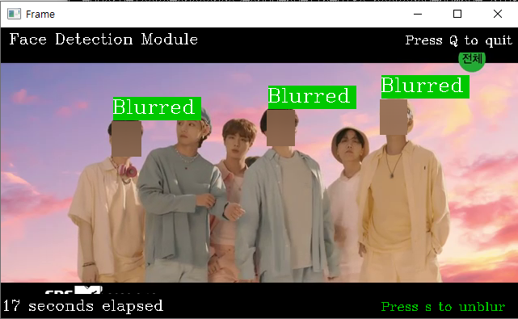
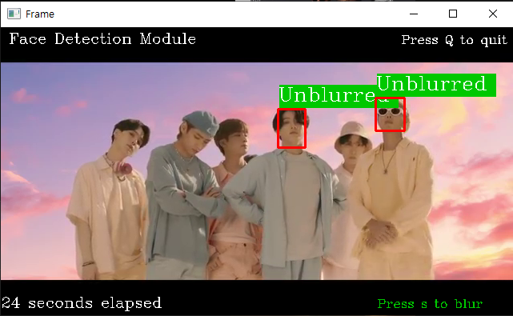

# Face Detection

# Capture Detected Face from Cam

- Run capture_face.py to save image when face is detected from the video feed

```python
$ python capture_face.py --source 0 # 1 if external cam is connected
																		# Else Plug in youtube link
```

- Press s to blur/unblur the video feed



Blurred



Unblurred

* Courtesy of BTS 

- Image, which will be saved to ./vid_rec/blurred/ or ./vid_rec/unblurred, depending on the status of bounding box, will be captured in every 5 seconds
- Press Q to exit Face Detection program
